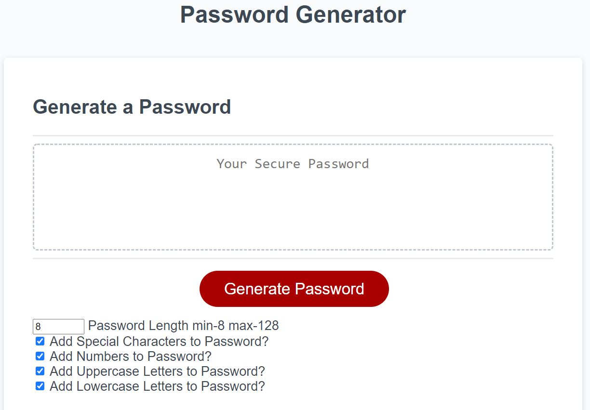

# Password Generator

## Work Completed
The starter code provided named the generatePassword() function within the writePassword() function, but it did not exist in the JavaScript file. To enable the writePassword() function to run properly a generatePassword() function was created in the global. 
The four options for characters for the unique password were placed into variables by type, one for special characters, numbers, uppercase, and lowercase letters. Then five additional variables were created that coincided with the checkboxes added below the generate password button. 
The checkboxes were given unique IDs linked to the variables by using the getElementById method. 
Then the function adds all of the checked boxes characters to the options for the unique password and then ensures that the password length is equal to the value that was placed in the number box and uses the Math.random method to randomly select characters to create a password which it then returns to the user. 

## References

[getElementById](https://developer.mozilla.org/en-US/docs/Web/API/Document/getElementById)

[.concat](https://www.w3schools.com/java/ref_string_concat.asp)

[Math.floor](https://www.w3schools.com/jsref/jsref_floor.asp)

[Math.random](https://www.w3schools.com/jsref/jsref_random.asp)

## Working Application

